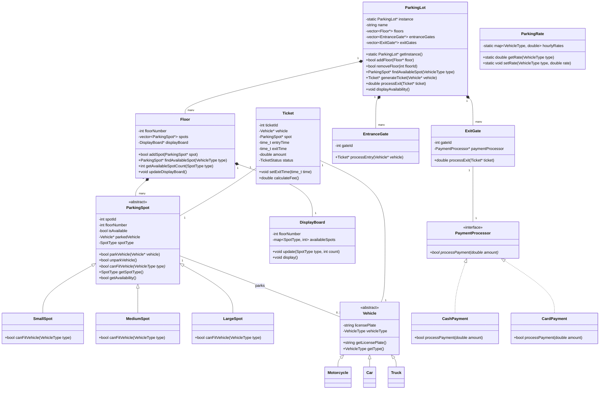

# Parking Lot - Low Level Design (LLD)

## 📋 Table of Contents
1. [Problem Statement](#problem-statement)
2. [Requirements](#requirements)
3. [Use Cases](#use-cases)
4. [UML Diagrams](#uml-diagrams)
5. [Class Design](#class-design)
6. [C++ Implementation](#c-implementation)
7. [Design Patterns Used](#design-patterns-used)
8. [Extensibility & Improvements](#extensibility--improvements)

---

## Problem Statement

Design a **Parking Lot System** that can:
- Manage multiple floors with different types of parking spots
- Handle different vehicle types (Motorcycle, Car, Truck)
- Track entry/exit and calculate parking fees
- Display available spots on each floor
- Support multiple entry/exit points

---

## Requirements

### Functional Requirements

| Requirement | Description |
|-------------|-------------|
| Multi-floor support | Parking lot should support multiple floors |
| Multiple spot types | Small, Medium, Large spots for different vehicles |
| Vehicle types | Motorcycle, Car, Truck |
| Ticket generation | Generate ticket on entry |
| Fee calculation | Calculate fee based on duration and vehicle type |
| Spot assignment | Assign nearest available spot |
| Display board | Show available spots per floor |

### Non-Functional Requirements

| Requirement | Description |
|-------------|-------------|
| Scalability | Support large number of spots |
| Concurrency | Handle multiple entry/exit simultaneously |
| Availability | System should be highly available |

### Capacity & Constraints

```
- Max floors: 5
- Spots per floor: ~500
- Vehicle types: Motorcycle, Car, Truck
- Spot types: Small (Motorcycle), Medium (Car), Large (Truck)
```

---

## Use Cases

```
┌─────────────────────────────────────────────────────────────────┐
│                        PARKING LOT SYSTEM                        │
├─────────────────────────────────────────────────────────────────┤
│                                                                  │
│   ┌─────────┐                                    ┌─────────┐    │
│   │ Customer│                                    │  Admin  │    │
│   └────┬────┘                                    └────┬────┘    │
│        │                                              │         │
│        ├──► Park Vehicle                              │         │
│        │                                              │         │
│        ├──► Unpark Vehicle                            │         │
│        │                                              │         │
│        ├──► Pay for Parking                           │         │
│        │                                              │         │
│        ├──► View Available Spots                      │         │
│        │                                              │         │
│        │                          Add/Remove Floor ◄──┤         │
│        │                                              │         │
│        │                          View Reports     ◄──┤         │
│        │                                              │         │
│        │                          Modify Rates     ◄──┤         │
│                                                                  │
└─────────────────────────────────────────────────────────────────┘
```

### Use Case Descriptions

| Use Case | Actor | Description |
|----------|-------|-------------|
| Park Vehicle | Customer | Customer enters, gets ticket, parks at assigned spot |
| Unpark Vehicle | Customer | Customer retrieves vehicle, pays fee, exits |
| Pay for Parking | Customer | Payment at exit gate or payment kiosk |
| View Available Spots | Customer/Admin | Display available spots per floor |
| Add/Remove Floor | Admin | Manage parking lot capacity |
| View Reports | Admin | Revenue reports, occupancy statistics |
| Modify Rates | Admin | Change hourly rates for vehicle types |

---

## UML Diagrams

### Class Diagram



### Sequence Diagram - Vehicle Entry

```
┌────────┐     ┌──────────────┐     ┌──────────┐     ┌───────┐     ┌────────────┐
│Customer│     │EntranceGate  │     │ParkingLot│     │ Floor │     │ParkingSpot │
└───┬────┘     └──────┬───────┘     └────┬─────┘     └───┬───┘     └─────┬──────┘
    │                 │                   │               │               │
    │ arrives with    │                   │               │               │
    │ vehicle         │                   │               │               │
    │────────────────>│                   │               │               │
    │                 │                   │               │               │
    │                 │ findAvailableSpot │               │               │
    │                 │──────────────────>│               │               │
    │                 │                   │               │               │
    │                 │                   │ findSpot()    │               │
    │                 │                   │──────────────>│               │
    │                 │                   │               │               │
    │                 │                   │               │ checkAvail()  │
    │                 │                   │               │──────────────>│
    │                 │                   │               │               │
    │                 │                   │               │<──────────────│
    │                 │                   │<──────────────│ spot          │
    │                 │<──────────────────│               │               │
    │                 │     spot          │               │               │
    │                 │                   │               │               │
    │                 │ generateTicket()  │               │               │
    │                 │──────────────────>│               │               │
    │                 │                   │               │               │
    │                 │<──────────────────│               │               │
    │                 │     ticket        │               │               │
    │<────────────────│                   │               │               │
    │   ticket +      │                   │               │               │
    │   spot location │                   │               │               │
    │                 │                   │               │               │
```

### Sequence Diagram - Vehicle Exit

```
┌────────┐     ┌─────────┐     ┌──────────┐     ┌────────┐     ┌─────────────────┐
│Customer│     │ExitGate │     │ParkingLot│     │ Ticket │     │PaymentProcessor │
└───┬────┘     └────┬────┘     └────┬─────┘     └───┬────┘     └────────┬────────┘
    │               │               │               │                   │
    │ presents      │               │               │                   │
    │ ticket        │               │               │                   │
    │──────────────>│               │               │                   │
    │               │               │               │                   │
    │               │ processExit() │               │                   │
    │               │──────────────>│               │                   │
    │               │               │               │                   │
    │               │               │ setExitTime() │                   │
    │               │               │──────────────>│                   │
    │               │               │               │                   │
    │               │               │ calculateFee()│                   │
    │               │               │──────────────>│                   │
    │               │               │               │                   │
    │               │               │<──────────────│                   │
    │               │               │    fee        │                   │
    │               │<──────────────│               │                   │
    │               │    fee        │               │                   │
    │<──────────────│               │               │                   │
    │   fee amount  │               │               │                   │
    │               │               │               │                   │
    │ makes payment │               │               │                   │
    │──────────────>│               │               │                   │
    │               │               │               │                   │
    │               │ processPayment()              │                   │
    │               │──────────────────────────────────────────────────>│
    │               │               │               │                   │
    │               │<──────────────────────────────────────────────────│
    │               │    success    │               │                   │
    │<──────────────│               │               │                   │
    │  gate opens   │               │               │                   │
    │               │               │               │                   │
```

### State Diagram - Parking Spot

```
                    ┌───────────────┐
                    │               │
                    │   AVAILABLE   │◄─────────────────┐
                    │               │                  │
                    └───────┬───────┘                  │
                            │                          │
                            │ parkVehicle()            │ unparkVehicle()
                            │                          │
                            ▼                          │
                    ┌───────────────┐                  │
                    │               │                  │
                    │   OCCUPIED    │──────────────────┘
                    │               │
                    └───────────────┘
```

### State Diagram - Ticket

```
     ┌────────────┐
     │            │
     │  CREATED   │
     │            │
     └─────┬──────┘
           │
           │ vehicle parked
           │
           ▼
     ┌────────────┐
     │            │
     │   ACTIVE   │
     │            │
     └─────┬──────┘
           │
           │ exit requested
           │
           ▼
     ┌────────────┐
     │            │
     │  PENDING   │
     │  PAYMENT   │
     │            │
     └─────┬──────┘
           │
           │ payment processed
           │
           ▼
     ┌────────────┐
     │            │
     │    PAID    │
     │            │
     └────────────┘
```

---

## Class Design

### Core Classes Overview

| Class | Responsibility | Pattern Used |
|-------|----------------|--------------|
| `ParkingLot` | Main class, manages floors and gates | Singleton |
| `Floor` | Manages parking spots on a floor | - |
| `ParkingSpot` | Abstract base for spot types | Strategy |
| `Vehicle` | Abstract base for vehicle types | - |
| `Ticket` | Tracks parking session | - |
| `PaymentProcessor` | Handles payment | Strategy |
| `DisplayBoard` | Shows availability | Observer |
| `ParkingRate` | Manages pricing | - |

### Relationships

```
┌─────────────────────────────────────────────────────────────────────────────┐
│                           RELATIONSHIP MAPPING                               │
├─────────────────────────────────────────────────────────────────────────────┤
│                                                                              │
│  ParkingLot ◆────────── Floor         (Composition: 1 to many)              │
│                                                                              │
│  Floor ◆────────────── ParkingSpot    (Composition: 1 to many)              │
│                                                                              │
│  ParkingSpot ◁──────── SmallSpot      (Inheritance)                         │
│              ◁──────── MediumSpot                                           │
│              ◁──────── LargeSpot                                            │
│                                                                              │
│  Vehicle ◁──────────── Motorcycle     (Inheritance)                         │
│          ◁──────────── Car                                                  │
│          ◁──────────── Truck                                                │
│                                                                              │
│  ParkingSpot ○──────── Vehicle        (Association: 0..1)                   │
│                                                                              │
│  Ticket ────────────── Vehicle        (Association: 1 to 1)                 │
│        ────────────── ParkingSpot     (Association: 1 to 1)                 │
│                                                                              │
│  PaymentProcessor ◁─── CashPayment    (Realization/Implementation)          │
│                   ◁─── CardPayment                                          │
│                                                                              │
└─────────────────────────────────────────────────────────────────────────────┘
```

---

## C++ Implementation

### Enumerations

```cpp
#include <iostream>
#include <vector>
#include <map>
#include <string>
#include <ctime>
#include <memory>
#include <mutex>
#include <iomanip>
using namespace std;

// ==================== ENUMERATIONS ====================

enum class VehicleType {
    MOTORCYCLE,
    CAR,
    TRUCK
};

enum class SpotType {
    SMALL,      // For motorcycles
    MEDIUM,     // For cars
    LARGE       // For trucks
};

enum class TicketStatus {
    CREATED,
    ACTIVE,
    PENDING_PAYMENT,
    PAID
};

// Helper function to convert enum to string
string vehicleTypeToString(VehicleType type) {
    switch (type) {
        case VehicleType::MOTORCYCLE: return "Motorcycle";
        case VehicleType::CAR: return "Car";
        case VehicleType::TRUCK: return "Truck";
        default: return "Unknown";
    }
}

string spotTypeToString(SpotType type) {
    switch (type) {
        case SpotType::SMALL: return "Small";
        case SpotType::MEDIUM: return "Medium";
        case SpotType::LARGE: return "Large";
        default: return "Unknown";
    }
}
```

### Vehicle Classes

```cpp
// ==================== VEHICLE CLASSES ====================

// Abstract Base Class
class Vehicle {
protected:
    string licensePlate;
    VehicleType vehicleType;

public:
    Vehicle(const string& plate, VehicleType type)
        : licensePlate(plate), vehicleType(type) {}
    
    virtual ~Vehicle() = default;
    
    string getLicensePlate() const { return licensePlate; }
    VehicleType getType() const { return vehicleType; }
    
    virtual void displayInfo() const {
        cout << "Vehicle: " << vehicleTypeToString(vehicleType)
             << " | Plate: " << licensePlate << endl;
    }
};

// Concrete Vehicle Classes
class Motorcycle : public Vehicle {
public:
    Motorcycle(const string& plate)
        : Vehicle(plate, VehicleType::MOTORCYCLE) {}
};

class Car : public Vehicle {
public:
    Car(const string& plate)
        : Vehicle(plate, VehicleType::CAR) {}
};

class Truck : public Vehicle {
public:
    Truck(const string& plate)
        : Vehicle(plate, VehicleType::TRUCK) {}
};
```

### ParkingSpot Classes

```cpp
// ==================== PARKING SPOT CLASSES ====================

// Abstract Base Class
class ParkingSpot {
protected:
    int spotId;
    int floorNumber;
    bool isAvailable;
    Vehicle* parkedVehicle;
    SpotType spotType;
    mutable mutex spotMutex;

public:
    ParkingSpot(int id, int floor, SpotType type)
        : spotId(id), floorNumber(floor), spotType(type),
          isAvailable(true), parkedVehicle(nullptr) {}
    
    virtual ~ParkingSpot() = default;
    
    // Pure virtual - each spot type defines what vehicles can fit
    virtual bool canFitVehicle(VehicleType type) const = 0;
    
    bool parkVehicle(Vehicle* vehicle) {
        lock_guard<mutex> lock(spotMutex);
        
        if (!isAvailable || !canFitVehicle(vehicle->getType())) {
            return false;
        }
        
        parkedVehicle = vehicle;
        isAvailable = false;
        cout << "✓ Vehicle " << vehicle->getLicensePlate()
             << " parked at Spot " << spotId
             << " on Floor " << floorNumber << endl;
        return true;
    }
    
    bool unparkVehicle() {
        lock_guard<mutex> lock(spotMutex);
        
        if (isAvailable) {
            return false;
        }
        
        cout << "✓ Vehicle " << parkedVehicle->getLicensePlate()
             << " removed from Spot " << spotId << endl;
        parkedVehicle = nullptr;
        isAvailable = true;
        return true;
    }
    
    // Getters
    int getSpotId() const { return spotId; }
    int getFloorNumber() const { return floorNumber; }
    SpotType getSpotType() const { return spotType; }
    bool getAvailability() const { return isAvailable; }
    Vehicle* getParkedVehicle() const { return parkedVehicle; }
};

// Small Spot - Only for Motorcycles
class SmallSpot : public ParkingSpot {
public:
    SmallSpot(int id, int floor)
        : ParkingSpot(id, floor, SpotType::SMALL) {}
    
    bool canFitVehicle(VehicleType type) const override {
        return type == VehicleType::MOTORCYCLE;
    }
};

// Medium Spot - For Motorcycles and Cars
class MediumSpot : public ParkingSpot {
public:
    MediumSpot(int id, int floor)
        : ParkingSpot(id, floor, SpotType::MEDIUM) {}
    
    bool canFitVehicle(VehicleType type) const override {
        return type == VehicleType::MOTORCYCLE ||
               type == VehicleType::CAR;
    }
};

// Large Spot - For all vehicle types
class LargeSpot : public ParkingSpot {
public:
    LargeSpot(int id, int floor)
        : ParkingSpot(id, floor, SpotType::LARGE) {}
    
    bool canFitVehicle(VehicleType type) const override {
        return true; // Can fit any vehicle
    }
};
```

### ParkingRate Class

```cpp
// ==================== PARKING RATE ====================

class ParkingRate {
private:
    static map<VehicleType, double> hourlyRates;
    static mutex rateMutex;

public:
    static void initialize() {
        hourlyRates[VehicleType::MOTORCYCLE] = 10.0;
        hourlyRates[VehicleType::CAR] = 20.0;
        hourlyRates[VehicleType::TRUCK] = 30.0;
    }
    
    static double getRate(VehicleType type) {
        lock_guard<mutex> lock(rateMutex);
        return hourlyRates[type];
    }
    
    static void setRate(VehicleType type, double rate) {
        lock_guard<mutex> lock(rateMutex);
        hourlyRates[type] = rate;
        cout << "Rate updated for " << vehicleTypeToString(type)
             << ": $" << rate << "/hour" << endl;
    }
    
    static void displayRates() {
        cout << "\n╔══════════════════════════════════╗" << endl;
        cout << "║       PARKING RATES              ║" << endl;
        cout << "╠══════════════════════════════════╣" << endl;
        cout << "║  Motorcycle:  $" << setw(6) << hourlyRates[VehicleType::MOTORCYCLE] << "/hour    ║" << endl;
        cout << "║  Car:         $" << setw(6) << hourlyRates[VehicleType::CAR] << "/hour    ║" << endl;
        cout << "║  Truck:       $" << setw(6) << hourlyRates[VehicleType::TRUCK] << "/hour    ║" << endl;
        cout << "╚══════════════════════════════════╝\n" << endl;
    }
};

// Static member initialization
map<VehicleType, double> ParkingRate::hourlyRates;
mutex ParkingRate::rateMutex;
```

### Ticket Class

```cpp
// ==================== TICKET CLASS ====================

class Ticket {
private:
    static int ticketCounter;
    int ticketId;
    Vehicle* vehicle;
    ParkingSpot* spot;
    time_t entryTime;
    time_t exitTime;
    double amount;
    TicketStatus status;

public:
    Ticket(Vehicle* v, ParkingSpot* s)
        : ticketId(++ticketCounter), vehicle(v), spot(s),
          amount(0), status(TicketStatus::ACTIVE) {
        entryTime = time(nullptr);
        exitTime = 0;
    }
    
    void setExitTime() {
        exitTime = time(nullptr);
        status = TicketStatus::PENDING_PAYMENT;
    }
    
    double calculateFee() {
        if (exitTime == 0) {
            setExitTime();
        }
        
        // Calculate duration in hours (minimum 1 hour)
        double hours = difftime(exitTime, entryTime) / 3600.0;
        if (hours < 1) hours = 1;
        
        // Get hourly rate based on vehicle type
        double rate = ParkingRate::getRate(vehicle->getType());
        amount = hours * rate;
        
        return amount;
    }
    
    void markPaid() {
        status = TicketStatus::PAID;
    }
    
    // Getters
    int getTicketId() const { return ticketId; }
    Vehicle* getVehicle() const { return vehicle; }
    ParkingSpot* getSpot() const { return spot; }
    time_t getEntryTime() const { return entryTime; }
    time_t getExitTime() const { return exitTime; }
    double getAmount() const { return amount; }
    TicketStatus getStatus() const { return status; }
    
    void displayTicket() const {
        cout << "\n╔══════════════════════════════════════╗" << endl;
        cout << "║          PARKING TICKET              ║" << endl;
        cout << "╠══════════════════════════════════════╣" << endl;
        cout << "║  Ticket ID:   " << setw(20) << ticketId << "  ║" << endl;
        cout << "║  Vehicle:     " << setw(20) << vehicle->getLicensePlate() << "  ║" << endl;
        cout << "║  Type:        " << setw(20) << vehicleTypeToString(vehicle->getType()) << "  ║" << endl;
        cout << "║  Floor:       " << setw(20) << spot->getFloorNumber() << "  ║" << endl;
        cout << "║  Spot:        " << setw(20) << spot->getSpotId() << "  ║" << endl;
        
        char timeBuffer[26];
        ctime_s(timeBuffer, sizeof(timeBuffer), &entryTime);
        string entryStr(timeBuffer);
        entryStr = entryStr.substr(0, entryStr.length() - 1);
        cout << "║  Entry Time:  " << setw(20) << entryStr << "  ║" << endl;
        
        if (exitTime != 0) {
            ctime_s(timeBuffer, sizeof(timeBuffer), &exitTime);
            string exitStr(timeBuffer);
            exitStr = exitStr.substr(0, exitStr.length() - 1);
            cout << "║  Exit Time:   " << setw(20) << exitStr << "  ║" << endl;
            cout << "║  Amount:      $" << setw(19) << fixed << setprecision(2) << amount << "  ║" << endl;
        }
        cout << "╚══════════════════════════════════════╝\n" << endl;
    }
};

int Ticket::ticketCounter = 0;
```

### DisplayBoard Class

```cpp
// ==================== DISPLAY BOARD ====================

class DisplayBoard {
private:
    int floorNumber;
    map<SpotType, int> availableSpots;

public:
    DisplayBoard(int floor) : floorNumber(floor) {
        availableSpots[SpotType::SMALL] = 0;
        availableSpots[SpotType::MEDIUM] = 0;
        availableSpots[SpotType::LARGE] = 0;
    }
    
    void update(SpotType type, int count) {
        availableSpots[type] = count;
    }
    
    void display() const {
        cout << "╔═══════════════════════════════════════╗" << endl;
        cout << "║     FLOOR " << floorNumber << " - AVAILABLE SPOTS        ║" << endl;
        cout << "╠═══════════════════════════════════════╣" << endl;
        cout << "║  🏍  Small (Motorcycle): " << setw(8) << availableSpots.at(SpotType::SMALL) << "      ║" << endl;
        cout << "║  🚗 Medium (Car):        " << setw(8) << availableSpots.at(SpotType::MEDIUM) << "      ║" << endl;
        cout << "║  🚚 Large (Truck):       " << setw(8) << availableSpots.at(SpotType::LARGE) << "      ║" << endl;
        cout << "╚═══════════════════════════════════════╝" << endl;
    }
};
```

### Floor Class

```cpp
// ==================== FLOOR CLASS ====================

class Floor {
private:
    int floorNumber;
    vector<ParkingSpot*> spots;
    DisplayBoard* displayBoard;

public:
    Floor(int number) : floorNumber(number) {
        displayBoard = new DisplayBoard(number);
    }
    
    ~Floor() {
        for (auto spot : spots) {
            delete spot;
        }
        delete displayBoard;
    }
    
    bool addSpot(ParkingSpot* spot) {
        spots.push_back(spot);
        updateDisplayBoard();
        return true;
    }
    
    // Find best available spot for vehicle type
    ParkingSpot* findAvailableSpot(VehicleType vehicleType) {
        // First, try to find exact match spot type
        SpotType preferredSpot;
        switch (vehicleType) {
            case VehicleType::MOTORCYCLE:
                preferredSpot = SpotType::SMALL;
                break;
            case VehicleType::CAR:
                preferredSpot = SpotType::MEDIUM;
                break;
            case VehicleType::TRUCK:
                preferredSpot = SpotType::LARGE;
                break;
        }
        
        // Try preferred spot type first
        for (auto spot : spots) {
            if (spot->getAvailability() &&
                spot->getSpotType() == preferredSpot &&
                spot->canFitVehicle(vehicleType)) {
                return spot;
            }
        }
        
        // If not found, try any fitting spot
        for (auto spot : spots) {
            if (spot->getAvailability() &&
                spot->canFitVehicle(vehicleType)) {
                return spot;
            }
        }
        
        return nullptr;
    }
    
    int getAvailableSpotCount(SpotType type) const {
        int count = 0;
        for (const auto& spot : spots) {
            if (spot->getSpotType() == type && spot->getAvailability()) {
                count++;
            }
        }
        return count;
    }
    
    void updateDisplayBoard() {
        displayBoard->update(SpotType::SMALL, getAvailableSpotCount(SpotType::SMALL));
        displayBoard->update(SpotType::MEDIUM, getAvailableSpotCount(SpotType::MEDIUM));
        displayBoard->update(SpotType::LARGE, getAvailableSpotCount(SpotType::LARGE));
    }
    
    void showDisplayBoard() const {
        displayBoard->display();
    }
    
    int getFloorNumber() const { return floorNumber; }
    int getTotalSpots() const { return spots.size(); }
};
```

### Payment Classes

```cpp
// ==================== PAYMENT CLASSES ====================

// Strategy Pattern - Payment Interface
class PaymentProcessor {
public:
    virtual ~PaymentProcessor() = default;
    virtual bool processPayment(double amount) = 0;
};

class CashPayment : public PaymentProcessor {
public:
    bool processPayment(double amount) override {
        cout << "💵 Processing cash payment of $" << fixed
             << setprecision(2) << amount << "..." << endl;
        cout << "✓ Cash payment successful!" << endl;
        return true;
    }
};

class CardPayment : public PaymentProcessor {
private:
    string cardNumber;
    
public:
    CardPayment(const string& card = "") : cardNumber(card) {}
    
    bool processPayment(double amount) override {
        cout << "💳 Processing card payment of $" << fixed
             << setprecision(2) << amount << "..." << endl;
        // Simulate card processing
        cout << "✓ Card payment successful!" << endl;
        return true;
    }
};
```

### Gate Classes

```cpp
// ==================== GATE CLASSES ====================

// Forward declaration
class ParkingLot;

class EntranceGate {
private:
    int gateId;

public:
    EntranceGate(int id) : gateId(id) {}
    
    int getGateId() const { return gateId; }
    
    // Implementation depends on ParkingLot, defined later
    Ticket* processEntry(Vehicle* vehicle);
};

class ExitGate {
private:
    int gateId;
    PaymentProcessor* paymentProcessor;

public:
    ExitGate(int id) : gateId(id), paymentProcessor(nullptr) {}
    
    ~ExitGate() {
        delete paymentProcessor;
    }
    
    void setPaymentProcessor(PaymentProcessor* processor) {
        if (paymentProcessor) delete paymentProcessor;
        paymentProcessor = processor;
    }
    
    int getGateId() const { return gateId; }
    
    // Implementation depends on ParkingLot, defined later
    double processExit(Ticket* ticket);
};
```

### ParkingLot Class (Singleton)

```cpp
// ==================== PARKING LOT CLASS (SINGLETON) ====================

class ParkingLot {
private:
    static ParkingLot* instance;
    static mutex instanceMutex;
    
    string name;
    vector<Floor*> floors;
    vector<EntranceGate*> entranceGates;
    vector<ExitGate*> exitGates;
    map<int, Ticket*> activeTickets;  // ticketId -> Ticket
    mutex lotMutex;
    
    // Private constructor for Singleton
    ParkingLot(const string& lotName) : name(lotName) {
        ParkingRate::initialize();
        cout << "🅿️  Parking Lot '" << name << "' created!" << endl;
    }

public:
    // Delete copy constructor and assignment
    ParkingLot(const ParkingLot&) = delete;
    ParkingLot& operator=(const ParkingLot&) = delete;
    
    ~ParkingLot() {
        for (auto floor : floors) delete floor;
        for (auto gate : entranceGates) delete gate;
        for (auto gate : exitGates) delete gate;
        for (auto& [id, ticket] : activeTickets) delete ticket;
    }
    
    // Singleton accessor
    static ParkingLot* getInstance(const string& name = "Main Parking Lot") {
        lock_guard<mutex> lock(instanceMutex);
        if (instance == nullptr) {
            instance = new ParkingLot(name);
        }
        return instance;
    }
    
    static void destroyInstance() {
        lock_guard<mutex> lock(instanceMutex);
        delete instance;
        instance = nullptr;
    }
    
    // Floor Management
    bool addFloor(Floor* floor) {
        lock_guard<mutex> lock(lotMutex);
        floors.push_back(floor);
        cout << "✓ Floor " << floor->getFloorNumber() << " added" << endl;
        return true;
    }
    
    // Gate Management
    bool addEntranceGate(EntranceGate* gate) {
        lock_guard<mutex> lock(lotMutex);
        entranceGates.push_back(gate);
        cout << "✓ Entrance Gate " << gate->getGateId() << " added" << endl;
        return true;
    }
    
    bool addExitGate(ExitGate* gate) {
        lock_guard<mutex> lock(lotMutex);
        exitGates.push_back(gate);
        cout << "✓ Exit Gate " << gate->getGateId() << " added" << endl;
        return true;
    }
    
    // Find available spot across all floors
    ParkingSpot* findAvailableSpot(VehicleType type) {
        for (auto floor : floors) {
            ParkingSpot* spot = floor->findAvailableSpot(type);
            if (spot != nullptr) {
                return spot;
            }
        }
        return nullptr;
    }
    
    // Generate ticket for vehicle
    Ticket* generateTicket(Vehicle* vehicle) {
        lock_guard<mutex> lock(lotMutex);
        
        ParkingSpot* spot = findAvailableSpot(vehicle->getType());
        if (spot == nullptr) {
            cout << "❌ No available spot for "
                 << vehicleTypeToString(vehicle->getType()) << endl;
            return nullptr;
        }
        
        if (!spot->parkVehicle(vehicle)) {
            return nullptr;
        }
        
        Ticket* ticket = new Ticket(vehicle, spot);
        activeTickets[ticket->getTicketId()] = ticket;
        
        // Update display boards
        for (auto floor : floors) {
            floor->updateDisplayBoard();
        }
        
        return ticket;
    }
    
    // Process exit
    double processExit(Ticket* ticket, PaymentProcessor* processor) {
        lock_guard<mutex> lock(lotMutex);
        
        if (ticket == nullptr) {
            cout << "❌ Invalid ticket!" << endl;
            return -1;
        }
        
        double fee = ticket->calculateFee();
        ticket->displayTicket();
        
        if (processor->processPayment(fee)) {
            ticket->markPaid();
            ticket->getSpot()->unparkVehicle();
            activeTickets.erase(ticket->getTicketId());
            
            // Update display boards
            for (auto floor : floors) {
                floor->updateDisplayBoard();
            }
            
            return fee;
        }
        
        return -1;
    }
    
    // Display availability
    void displayAvailability() const {
        cout << "\n╔═══════════════════════════════════════════╗" << endl;
        cout << "║     " << name << " - AVAILABILITY      ║" << endl;
        cout << "╚═══════════════════════════════════════════╝\n" << endl;
        
        for (const auto& floor : floors) {
            floor->showDisplayBoard();
            cout << endl;
        }
    }
    
    string getName() const { return name; }
    int getFloorCount() const { return floors.size(); }
};

// Static member initialization
ParkingLot* ParkingLot::instance = nullptr;
mutex ParkingLot::instanceMutex;

// Gate implementations (now that ParkingLot is defined)
Ticket* EntranceGate::processEntry(Vehicle* vehicle) {
    cout << "\n🚗 Vehicle " << vehicle->getLicensePlate()
         << " entering through Gate " << gateId << endl;
    return ParkingLot::getInstance()->generateTicket(vehicle);
}

double ExitGate::processExit(Ticket* ticket) {
    cout << "\n🚗 Vehicle exiting through Gate " << gateId << endl;
    if (paymentProcessor == nullptr) {
        paymentProcessor = new CashPayment();
    }
    return ParkingLot::getInstance()->processExit(ticket, paymentProcessor);
}
```

### Main Function - Demo

```cpp
// ==================== MAIN - DEMONSTRATION ====================

int main() {
    cout << "╔═══════════════════════════════════════════════════════════╗" << endl;
    cout << "║          PARKING LOT SYSTEM - DEMONSTRATION              ║" << endl;
    cout << "╚═══════════════════════════════════════════════════════════╝\n" << endl;
    
    // 1. Create Parking Lot (Singleton)
    ParkingLot* parkingLot = ParkingLot::getInstance("City Center Parking");
    
    cout << "\n=== Setting up Parking Lot ===" << endl;
    
    // 2. Create and add floors
    Floor* floor1 = new Floor(1);
    Floor* floor2 = new Floor(2);
    
    parkingLot->addFloor(floor1);
    parkingLot->addFloor(floor2);
    
    // 3. Add parking spots to Floor 1
    cout << "\n=== Adding spots to Floor 1 ===" << endl;
    for (int i = 1; i <= 5; i++) {
        floor1->addSpot(new SmallSpot(i, 1));
    }
    for (int i = 6; i <= 15; i++) {
        floor1->addSpot(new MediumSpot(i, 1));
    }
    for (int i = 16; i <= 20; i++) {
        floor1->addSpot(new LargeSpot(i, 1));
    }
    
    // 4. Add parking spots to Floor 2
    cout << "\n=== Adding spots to Floor 2 ===" << endl;
    for (int i = 1; i <= 3; i++) {
        floor2->addSpot(new SmallSpot(i, 2));
    }
    for (int i = 4; i <= 13; i++) {
        floor2->addSpot(new MediumSpot(i, 2));
    }
    for (int i = 14; i <= 18; i++) {
        floor2->addSpot(new LargeSpot(i, 2));
    }
    
    // 5. Add gates
    cout << "\n=== Adding gates ===" << endl;
    EntranceGate* entrance1 = new EntranceGate(1);
    EntranceGate* entrance2 = new EntranceGate(2);
    ExitGate* exit1 = new ExitGate(1);
    ExitGate* exit2 = new ExitGate(2);
    
    parkingLot->addEntranceGate(entrance1);
    parkingLot->addEntranceGate(entrance2);
    parkingLot->addExitGate(exit1);
    parkingLot->addExitGate(exit2);
    
    // 6. Display parking rates
    ParkingRate::displayRates();
    
    // 7. Display initial availability
    parkingLot->displayAvailability();
    
    // 8. Simulate vehicle entry
    cout << "\n╔═══════════════════════════════════════════════════════════╗" << endl;
    cout << "║              SIMULATING VEHICLE ENTRIES                   ║" << endl;
    cout << "╚═══════════════════════════════════════════════════════════╝" << endl;
    
    // Create vehicles
    Car* car1 = new Car("ABC-1234");
    Car* car2 = new Car("XYZ-5678");
    Motorcycle* bike1 = new Motorcycle("BIKE-001");
    Truck* truck1 = new Truck("TRUCK-100");
    
    // Entry through gates
    Ticket* ticket1 = entrance1->processEntry(car1);
    if (ticket1) ticket1->displayTicket();
    
    Ticket* ticket2 = entrance1->processEntry(bike1);
    if (ticket2) ticket2->displayTicket();
    
    Ticket* ticket3 = entrance2->processEntry(car2);
    if (ticket3) ticket3->displayTicket();
    
    Ticket* ticket4 = entrance2->processEntry(truck1);
    if (ticket4) ticket4->displayTicket();
    
    // 9. Display updated availability
    parkingLot->displayAvailability();
    
    // 10. Simulate vehicle exit
    cout << "\n╔═══════════════════════════════════════════════════════════╗" << endl;
    cout << "║              SIMULATING VEHICLE EXITS                     ║" << endl;
    cout << "╚═══════════════════════════════════════════════════════════╝" << endl;
    
    // Set up payment processors
    exit1->setPaymentProcessor(new CashPayment());
    exit2->setPaymentProcessor(new CardPayment());
    
    // Exit vehicles
    if (ticket1) {
        double fee1 = exit1->processExit(ticket1);
        cout << "Total fee paid: $" << fixed << setprecision(2) << fee1 << endl;
    }
    
    if (ticket4) {
        double fee4 = exit2->processExit(ticket4);
        cout << "Total fee paid: $" << fixed << setprecision(2) << fee4 << endl;
    }
    
    // 11. Display final availability
    parkingLot->displayAvailability();
    
    // Cleanup
    delete car1;
    delete car2;
    delete bike1;
    delete truck1;
    
    ParkingLot::destroyInstance();
    
    cout << "\n✅ Parking Lot System demonstration complete!" << endl;
    
    return 0;
}
```

---

## Design Patterns Used

### 1. Singleton Pattern

```
┌─────────────────────────────────────────────────────────────────┐
│                    SINGLETON - ParkingLot                        │
├─────────────────────────────────────────────────────────────────┤
│                                                                  │
│  Purpose: Ensure only ONE parking lot instance exists            │
│                                                                  │
│  ┌───────────────────────────────────────────────────┐          │
│  │  ParkingLot                                       │          │
│  │  ───────────────────────────────────────────────  │          │
│  │  - static ParkingLot* instance                    │          │
│  │  - static mutex instanceMutex                     │          │
│  │  - ParkingLot() // private constructor            │          │
│  │  ───────────────────────────────────────────────  │          │
│  │  + static getInstance(): ParkingLot*              │          │
│  │  + static destroyInstance(): void                 │          │
│  └───────────────────────────────────────────────────┘          │
│                                                                  │
│  Benefits:                                                       │
│  ✓ Single point of control                                      │
│  ✓ Thread-safe with mutex                                       │
│  ✓ Lazy initialization                                          │
│                                                                  │
└─────────────────────────────────────────────────────────────────┘
```

### 2. Strategy Pattern

```
┌─────────────────────────────────────────────────────────────────┐
│                    STRATEGY - Payment Processing                 │
├─────────────────────────────────────────────────────────────────┤
│                                                                  │
│                   «interface»                                    │
│              ┌─────────────────────┐                            │
│              │  PaymentProcessor   │                            │
│              │─────────────────────│                            │
│              │+ processPayment()   │                            │
│              └─────────┬───────────┘                            │
│                        │                                         │
│           ┌────────────┴────────────┐                           │
│           │                         │                            │
│    ┌──────┴──────┐          ┌──────┴──────┐                     │
│    │ CashPayment │          │ CardPayment │                     │
│    │─────────────│          │─────────────│                     │
│    │+process     │          │+process     │                     │
│    │ Payment()   │          │ Payment()   │                     │
│    └─────────────┘          └─────────────┘                     │
│                                                                  │
│  Benefits:                                                       │
│  ✓ Easy to add new payment methods                              │
│  ✓ Open/Closed principle                                        │
│  ✓ Runtime flexibility                                          │
│                                                                  │
└─────────────────────────────────────────────────────────────────┘
```

### 3. Factory Pattern (Implicit)

```
┌─────────────────────────────────────────────────────────────────┐
│                    FACTORY - Spot/Vehicle Creation               │
├─────────────────────────────────────────────────────────────────┤
│                                                                  │
│  Creating different types of spots/vehicles using                │
│  common interfaces:                                              │
│                                                                  │
│  ParkingSpot* spot1 = new SmallSpot(1, 1);                      │
│  ParkingSpot* spot2 = new MediumSpot(2, 1);                     │
│  ParkingSpot* spot3 = new LargeSpot(3, 1);                      │
│                                                                  │
│  Vehicle* v1 = new Car("ABC-123");                              │
│  Vehicle* v2 = new Motorcycle("BIKE-001");                      │
│  Vehicle* v3 = new Truck("TRUCK-100");                          │
│                                                                  │
│  Benefits:                                                       │
│  ✓ Polymorphism for spot/vehicle handling                       │
│  ✓ Easy to extend with new types                                │
│                                                                  │
└─────────────────────────────────────────────────────────────────┘
```

### 4. Template Method (Implicit in ParkingSpot)

```cpp
// Base class defines the algorithm structure
class ParkingSpot {
public:
    bool parkVehicle(Vehicle* vehicle) {
        // Template method - algorithm structure
        if (!isAvailable || !canFitVehicle(vehicle->getType())) {
            return false;  // Step 1: Validation
        }
        parkedVehicle = vehicle;  // Step 2: Assignment
        isAvailable = false;       // Step 3: State change
        return true;
    }
    
    // Hook method - overridden by subclasses
    virtual bool canFitVehicle(VehicleType type) const = 0;
};
```

---

## Extensibility & Improvements

### Potential Extensions

| Feature | Description | Implementation Hint |
|---------|-------------|---------------------|
| **Reservation System** | Reserve spots in advance | Add `ReservationManager` class |
| **Electric Vehicle Spots** | EV charging stations | New `EVSpot` subclass with charging logic |
| **Handicap Spots** | Priority spots near entrance | Add `SpotAttribute` enum |
| **Dynamic Pricing** | Surge pricing during peak hours | Enhance `ParkingRate` with time-based rules |
| **Multiple Parking Lots** | Manage multiple lots | Remove Singleton, use `ParkingLotManager` |
| **Monthly Pass** | Subscription-based parking | Add `PassHolder` class and validation |
| **Valet Parking** | Assisted parking service | Add `ValetService` class |
| **License Plate Recognition** | Automatic entry/exit | Add `LPRSystem` class |

### Code Quality Improvements

```cpp
// 1. Use smart pointers instead of raw pointers
unique_ptr<ParkingSpot> spot = make_unique<SmallSpot>(1, 1);
shared_ptr<Vehicle> vehicle = make_shared<Car>("ABC-123");

// 2. Add proper exception handling
class ParkingLotException : public exception {
public:
    explicit ParkingLotException(const string& msg) : message(msg) {}
    const char* what() const noexcept override { return message.c_str(); }
private:
    string message;
};

// 3. Add Observer pattern for display board updates
class SpotObserver {
public:
    virtual void onSpotStatusChanged(ParkingSpot* spot) = 0;
};

// 4. Add Builder pattern for complex ParkingLot setup
class ParkingLotBuilder {
public:
    ParkingLotBuilder& setName(const string& name);
    ParkingLotBuilder& addFloors(int count);
    ParkingLotBuilder& addSpotsPerFloor(int small, int medium, int large);
    ParkingLotBuilder& addGates(int entrance, int exit);
    ParkingLot* build();
};
```

### Complete System Architecture

```
┌────────────────────────────────────────────────────────────────────────────┐
│                         PARKING LOT SYSTEM ARCHITECTURE                     │
├────────────────────────────────────────────────────────────────────────────┤
│                                                                             │
│   ┌─────────────────────────────────────────────────────────────────────┐  │
│   │                          PRESENTATION LAYER                          │  │
│   │  ┌──────────────┐  ┌───────────────┐  ┌─────────────────────────┐   │  │
│   │  │ Display Board│  │ Entry Terminal│  │    Exit Terminal        │   │  │
│   │  └──────────────┘  └───────────────┘  └─────────────────────────┘   │  │
│   └─────────────────────────────────────────────────────────────────────┘  │
│                                    │                                        │
│   ┌─────────────────────────────────────────────────────────────────────┐  │
│   │                          BUSINESS LAYER                              │  │
│   │  ┌───────────────┐  ┌─────────────────┐  ┌───────────────────────┐  │  │
│   │  │  ParkingLot   │  │ TicketService   │  │  PaymentService       │  │  │
│   │  │  (Singleton)  │  │                 │  │  (Strategy Pattern)   │  │  │
│   │  └───────────────┘  └─────────────────┘  └───────────────────────┘  │  │
│   │  ┌───────────────┐  ┌─────────────────┐  ┌───────────────────────┐  │  │
│   │  │  SpotManager  │  │  RateManager    │  │  GateController       │  │  │
│   │  └───────────────┘  └─────────────────┘  └───────────────────────┘  │  │
│   └─────────────────────────────────────────────────────────────────────┘  │
│                                    │                                        │
│   ┌─────────────────────────────────────────────────────────────────────┐  │
│   │                          DATA LAYER                                  │  │
│   │  ┌───────────────┐  ┌─────────────────┐  ┌───────────────────────┐  │  │
│   │  │    Floors     │  │    Tickets      │  │    Vehicles           │  │  │
│   │  └───────────────┘  └─────────────────┘  └───────────────────────┘  │  │
│   │  ┌───────────────┐  ┌─────────────────┐  ┌───────────────────────┐  │  │
│   │  │ ParkingSpots  │  │    Payments     │  │    Rates              │  │  │
│   │  └───────────────┘  └─────────────────┘  └───────────────────────┘  │  │
│   └─────────────────────────────────────────────────────────────────────┘  │
│                                                                             │
└────────────────────────────────────────────────────────────────────────────┘
```

---

## Summary

### Key Design Decisions

| Decision | Rationale |
|----------|-----------|
| **Singleton for ParkingLot** | Single point of control, consistent state |
| **Abstract classes for Vehicle/Spot** | Polymorphism, easy extension |
| **Strategy for Payment** | Flexible payment method switching |
| **Composition over Inheritance** | Floors contain Spots, not inherit |
| **Thread-safe operations** | Support concurrent access |

### SOLID Principles Applied

| Principle | Application |
|-----------|-------------|
| **S** - Single Responsibility | Each class has one job (Ticket handles tickets, not payments) |
| **O** - Open/Closed | Add new vehicle/spot types without modifying existing code |
| **L** - Liskov Substitution | Any Vehicle subclass can be used where Vehicle is expected |
| **I** - Interface Segregation | PaymentProcessor only has payment-related methods |
| **D** - Dependency Inversion | High-level modules depend on abstractions (PaymentProcessor interface) |

### Interview Tips 💡

1. **Start with requirements** - Ask clarifying questions
2. **Identify core entities** - Vehicle, Spot, Ticket, Gate
3. **Define relationships** - Composition, Inheritance, Association
4. **Apply design patterns** - Singleton, Strategy, Factory
5. **Consider edge cases** - Full lot, invalid ticket, concurrent access
6. **Discuss extensibility** - How to add EV charging, reservations, etc.

---

**Author**: LLD Study Notes  
**Last Updated**: January 2026

