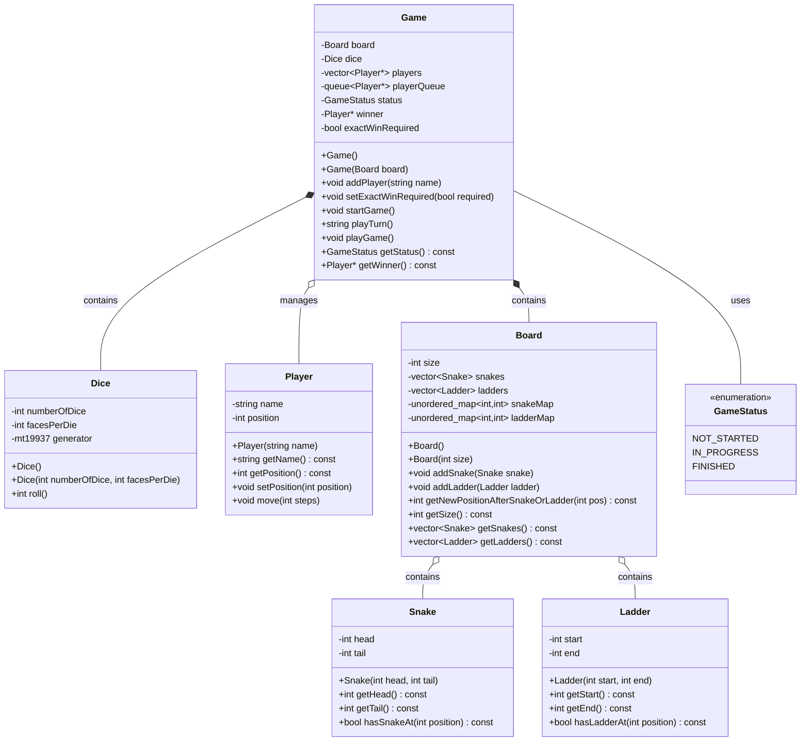
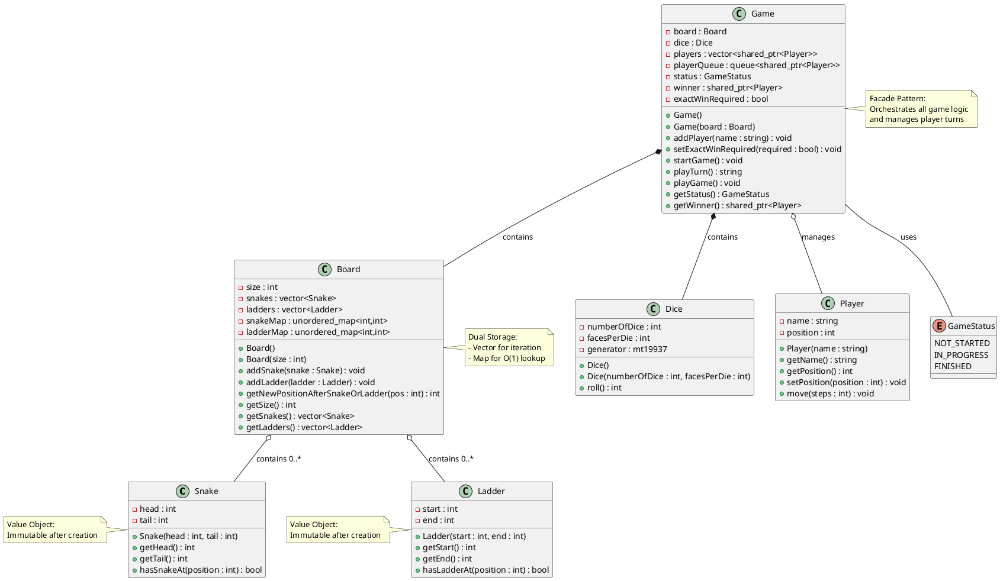
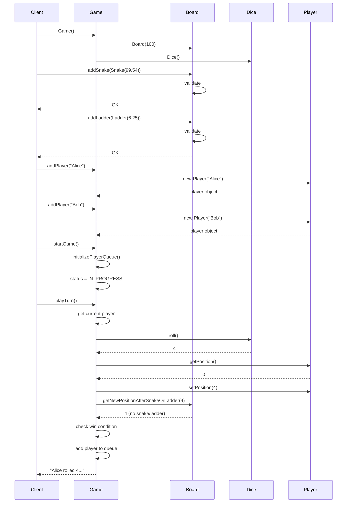
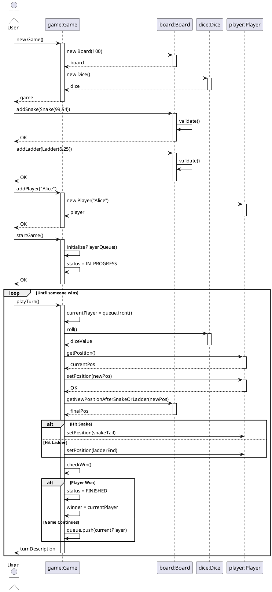

# Snake and Ladder - UML Diagrams

## Table of Contents
1. [Class Diagram (Mermaid)](#class-diagram-mermaid)
2. [Class Diagram (PlantUML)](#class-diagram-plantuml)
3. [Class Diagram (ASCII)](#class-diagram-ascii)
4. [Sequence Diagram](#sequence-diagram)
5. [Relationship Explanation](#relationship-explanation)

---

## Class Diagram (Mermaid)



---

## Class Diagram (PlantUML)



---

## Class Diagram (ASCII)

```
┌──────────────────────────────────────────────────────────────────┐
│                             GAME                                  │
│ ──────────────────────────────────────────────────────────────── │
│ - board : Board                                                   │
│ - dice : Dice                                                     │
│ - players : vector<shared_ptr<Player>>                            │
│ - playerQueue : queue<shared_ptr<Player>>                         │
│ - status : GameStatus                                             │
│ - winner : shared_ptr<Player>                                     │
│ - exactWinRequired : bool                                         │
│ ──────────────────────────────────────────────────────────────── │
│ + Game()                                                          │
│ + Game(board : Board)                                             │
│ + addPlayer(name : string) : void                                 │
│ + setExactWinRequired(required : bool) : void                     │
│ + startGame() : void                                              │
│ + playTurn() : string                                             │
│ + playGame() : void                                               │
│ + getStatus() : GameStatus                                        │
│ + getWinner() : shared_ptr<Player>                                │
└──────────┬────────────┬─────────────┬──────────────────────────────┘
           │            │             │
           │(contains)  │(contains)   │(manages)
           │            │             │
      ┌────▼──────┐ ┌──▼───────┐ ┌───▼──────────────┐
      │   BOARD   │ │   DICE   │ │     PLAYER       │
      └───────────┘ └──────────┘ └──────────────────┘
           │
           │(contains)
           │
    ┌──────┴─────────┐
    │                │
┌───▼──────┐    ┌────▼──────┐
│  SNAKE   │    │  LADDER   │
└──────────┘    └───────────┘


╔═══════════════════════════════════╗
║           SNAKE                   ║
╠═══════════════════════════════════╣
║ - head : int                      ║
║ - tail : int                      ║
╠═══════════════════════════════════╣
║ + Snake(head, tail)               ║
║ + getHead() : int                 ║
║ + getTail() : int                 ║
║ + hasSnakeAt(pos) : bool          ║
╚═══════════════════════════════════╝


╔═══════════════════════════════════╗
║           LADDER                  ║
╠═══════════════════════════════════╣
║ - start : int                     ║
║ - end : int                       ║
╠═══════════════════════════════════╣
║ + Ladder(start, end)              ║
║ + getStart() : int                ║
║ + getEnd() : int                  ║
║ + hasLadderAt(pos) : bool         ║
╚═══════════════════════════════════╝


╔═══════════════════════════════════╗
║           DICE                    ║
╠═══════════════════════════════════╣
║ - numberOfDice : int              ║
║ - facesPerDie : int               ║
║ - generator : mt19937             ║
╠═══════════════════════════════════╣
║ + Dice()                          ║
║ + Dice(num, faces)                ║
║ + roll() : int                    ║
╚═══════════════════════════════════╝


╔═══════════════════════════════════╗
║           PLAYER                  ║
╠═══════════════════════════════════╣
║ - name : string                   ║
║ - position : int                  ║
╠═══════════════════════════════════╣
║ + Player(name)                    ║
║ + getName() : string              ║
║ + getPosition() : int             ║
║ + setPosition(pos) : void         ║
║ + move(steps) : void              ║
╚═══════════════════════════════════╝


╔═══════════════════════════════════════════════════════╗
║                    BOARD                              ║
╠═══════════════════════════════════════════════════════╣
║ - size : int                                          ║
║ - snakes : vector<Snake>                              ║
║ - ladders : vector<Ladder>                            ║
║ - snakeMap : unordered_map<int,int>                   ║
║ - ladderMap : unordered_map<int,int>                  ║
╠═══════════════════════════════════════════════════════╣
║ + Board()                                             ║
║ + Board(size)                                         ║
║ + addSnake(snake) : void                              ║
║ + addLadder(ladder) : void                            ║
║ + getNewPositionAfterSnakeOrLadder(pos) : int         ║
║ + getSize() : int                                     ║
║ + getSnakes() : vector<Snake>                         ║
║ + getLadders() : vector<Ladder>                       ║
╚═══════════════════════════════════════════════════════╝


╔═══════════════════════╗
║   GameStatus (enum)   ║
╠═══════════════════════╣
║ NOT_STARTED           ║
║ IN_PROGRESS           ║
║ FINISHED              ║
╚═══════════════════════╝
```

---

## Sequence Diagram

### Game Initialization and Single Turn



### Complete Game Flow



---

## Relationship Explanation

### 1. **Game ◆── Board** (Composition)
- **Type**: Strong ownership (composition)
- **Multiplicity**: 1 to 1
- **Lifetime**: Board cannot exist without Game
- **Symbol**: ◆ (filled diamond)

```cpp
class Game {
    Board board;  // Game owns the board
};
```

### 2. **Game ◆── Dice** (Composition)
- **Type**: Strong ownership
- **Multiplicity**: 1 to 1
- **Lifetime**: Dice is created with Game
- **Symbol**: ◆ (filled diamond)

```cpp
class Game {
    Dice dice;  // Game owns the dice
};
```

### 3. **Game ◇── Player** (Aggregation)
- **Type**: Weak ownership (aggregation)
- **Multiplicity**: 1 to many (2..*)
- **Lifetime**: Players can exist independently
- **Symbol**: ◇ (hollow diamond)

```cpp
class Game {
    vector<shared_ptr<Player>> players;  // Game manages players
};
```

### 4. **Board ◇── Snake** (Aggregation)
- **Type**: Weak ownership
- **Multiplicity**: 1 to many (0..*)
- **Lifetime**: Snakes conceptually independent
- **Symbol**: ◇ (hollow diamond)

```cpp
class Board {
    vector<Snake> snakes;
    unordered_map<int, int> snakeMap;
};
```

### 5. **Board ◇── Ladder** (Aggregation)
- **Type**: Weak ownership
- **Multiplicity**: 1 to many (0..*)
- **Lifetime**: Ladders conceptually independent
- **Symbol**: ◇ (hollow diamond)

```cpp
class Board {
    vector<Ladder> ladders;
    unordered_map<int, int> ladderMap;
};
```

### 6. **Game ── GameStatus** (Dependency)
- **Type**: Usage dependency
- **Multiplicity**: 1 to 1
- **Symbol**: ── (simple line)

```cpp
class Game {
    GameStatus status;  // Game uses enum
};
```

---

## Relationship Summary Table

| From | To | Relationship | Type | Multiplicity | Symbol |
|------|-----|-------------|------|--------------|--------|
| Game | Board | Contains | Composition | 1:1 | ◆── |
| Game | Dice | Contains | Composition | 1:1 | ◆── |
| Game | Player | Manages | Aggregation | 1:* | ◇── |
| Game | GameStatus | Uses | Dependency | 1:1 | ── |
| Board | Snake | Contains | Aggregation | 1:* | ◇── |
| Board | Ladder | Contains | Aggregation | 1:* | ◇── |

---

## Design Patterns Visible in UML

### 1. **Facade Pattern**
```
Game acts as facade for:
- Board
- Dice  
- Players
- Game rules
```

**UML**: Game class with composition relationships to Board, Dice

### 2. **Value Object Pattern**
```
Snake and Ladder are immutable value objects:
- No setters
- Validation in constructor
- Only getters
```

**UML**: Snake and Ladder with private fields, public getters only

### 3. **State Pattern (Implicit)**
```
GameStatus enum manages game states:
- NOT_STARTED
- IN_PROGRESS
- FINISHED
```

**UML**: GameStatus enumeration associated with Game

---

## Key UML Annotations

### Visibility Markers
- `+` = public
- `-` = private
- `#` = protected

### Multiplicity
- `1` = exactly one
- `*` = zero or more
- `0..*` = zero or more (explicit)
- `1..*` = one or more
- `2..*` = two or more

### Relationship Types
- `──────` = Association
- `◇─────` = Aggregation (hollow diamond)
- `◆─────` = Composition (filled diamond)
- `◄─────` = Dependency (dashed arrow)
- `◄═════` = Inheritance (hollow triangle)

---

## How to Use These Diagrams

### For Mermaid:
1. Copy to markdown file
2. View in GitHub, GitLab, or VS Code with Mermaid extension

### For PlantUML:
1. Save to `.puml` file
2. Use PlantUML plugin in VS Code, IntelliJ, or online editor
3. Or visit: http://www.plantuml.com/plantuml/uml/

### For ASCII:
1. Copy to any text file or documentation
2. View in monospace font

---

## Complete System Overview

```
┌─────────────────────────────────────────────────────────┐
│                    CLIENT CODE                          │
│                      (main.cpp)                         │
└────────────────────┬────────────────────────────────────┘
                     │
                     │ creates & uses
                     ▼
         ┏━━━━━━━━━━━━━━━━━━━━━━━━┓
         ┃        GAME            ┃  ◄── Facade Pattern
         ┃  (Orchestrator)        ┃
         ┗━━━━━━━━━┳━━━━━━━━━━━━━━┛
                   │
         ┌─────────┼─────────┬──────────┐
         │         │         │          │
         ▼         ▼         ▼          ▼
    ┌────────┐ ┌──────┐ ┌────────┐ ┌─────────┐
    │ BOARD  │ │ DICE │ │ PLAYER │ │ STATUS  │
    └───┬────┘ └──────┘ └────────┘ └─────────┘
        │
        ├──── SNAKE (0..*)
        └──── LADDER (0..*)
```

---

## Notes for Implementation

1. **Composition vs Aggregation**:
   - Use composition (◆) when child cannot exist without parent
   - Use aggregation (◇) when child can exist independently

2. **Smart Pointers in C++**:
   - `shared_ptr<Player>` represents shared ownership
   - Affects whether relationship is composition or aggregation

3. **const Methods**:
   - Getters marked with `const` in class diagram
   - Indicates method doesn't modify object state

4. **Private Methods**:
   - `initializePlayerQueue()`, `validate()` etc. are private
   - Implementation details, not part of public interface

---

## Summary

This UML design shows:
- ✅ Clear separation of concerns
- ✅ Game as central orchestrator (Facade)
- ✅ Board managing game elements
- ✅ Proper use of composition and aggregation
- ✅ Value objects (Snake, Ladder) with minimal interface
- ✅ State management via enum

The design is **clean**, **modular**, and follows **SOLID principles**.
